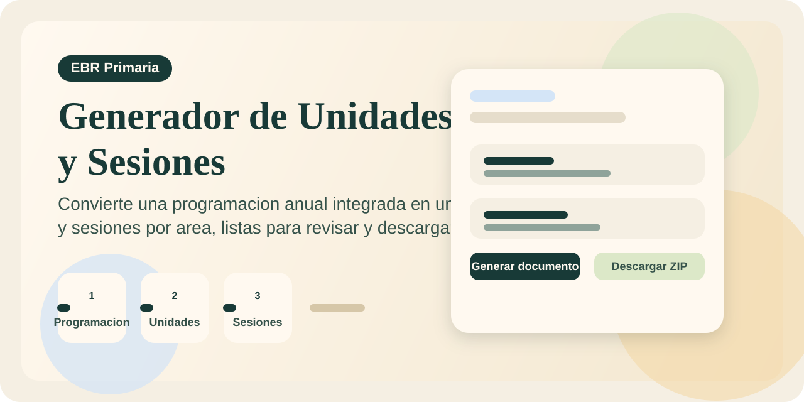
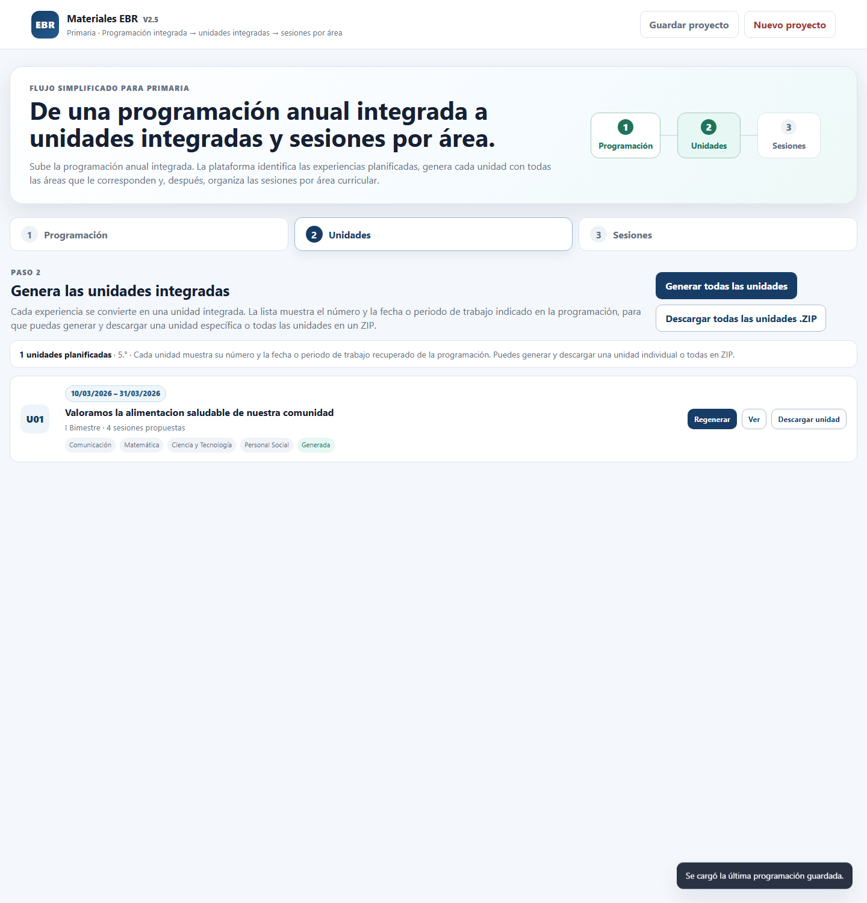
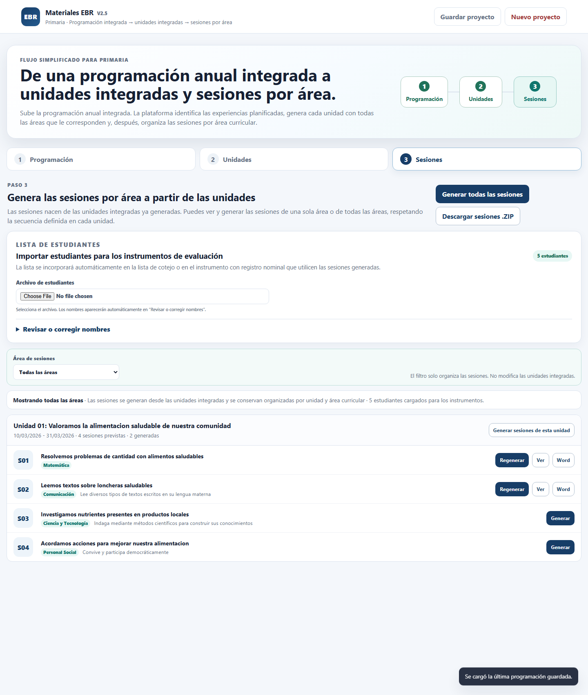

# Generador de Unidades y Sesiones EBR



Aplicacion web local para Primaria que transforma una programacion anual integrada en unidades integradas y sesiones por area curricular, manteniendo la programacion como documento madre del proyecto.

## Que resuelve

- Centraliza el flujo completo: programacion -> unidades -> sesiones.
- Evita rehacer informacion institucional, periodos, areas y experiencias ya definidas.
- Permite trabajar por etapas y descargar resultados individuales o en ZIP.
- Incorpora lista de estudiantes para completar instrumentos de evaluacion en las sesiones.

## Flujo principal

1. Cargar una programacion anual integrada en Word, PDF o TXT.
2. Revisar y confirmar los datos detectados por la plataforma.
3. Generar una unidad o todas las unidades integradas previstas.
4. Generar sesiones por area a partir de las unidades creadas.
5. Descargar unidades y sesiones en formato `.docx` o paquetes `.zip`.

## Funciones destacadas

- Pantalla de bienvenida para continuar el ultimo proyecto guardado o iniciar uno nuevo.
- Deteccion de institucion educativa, docente, ano, grados, areas y experiencias.
- Generacion de unidades integradas respetando la planificacion anual.
- Generacion de sesiones organizadas por area curricular.
- Importacion automatica de estudiantes desde `.xlsx`, `.csv`, `.docx` o `.txt`.
- Lista de cotejo con criterios y niveles `En inicio`, `En proceso` y `Logrado`.
- Vista previa antes de descargar documentos.

## Vista de la interfaz

### Inicio del proyecto

La plataforma muestra una bienvenida clara para continuar con el ultimo trabajo guardado o iniciar una programacion nueva.


### Generacion de unidades

Cada experiencia anual se convierte en una unidad integrada con accesos directos para generar, revisar y descargar.



### Generacion de sesiones por area

Las sesiones se organizan por unidad y area curricular, con soporte para importar estudiantes y completar instrumentos de evaluacion.



## Archivos compatibles

- Programacion anual: `.docx`, `.pdf`, `.txt`
- Lista de estudiantes: `.xlsx`, `.csv`, `.docx`, `.txt`
- Salida generada: `.docx`, `.zip`

## Como usarlo

1. Abre `index.html` en tu navegador.
2. Carga la programacion anual integrada.
3. Confirma los datos detectados.
4. Genera las unidades integradas.
5. Importa la lista de estudiantes si la necesitas.
6. Genera y descarga las sesiones por area.

## Estructura del proyecto

```text
.
|-- index.html
|-- assets/
|   |-- app.js
|   |-- curriculum.js
|   `-- styles.css
|-- data/
`-- README.md
```

## Notas importantes

- `index.html` es el punto de entrada.
- La plataforma guarda el proyecto en el navegador mediante almacenamiento local.
- No debe inventar datos institucionales o contextuales ausentes en la programacion.
- Las unidades son integradas; las sesiones se organizan por area.

## Version actual

`v2.5`

Incluye mejoras en la bienvenida inicial, la importacion automatica de estudiantes y el diseno de sesiones en formato A4 horizontal.
